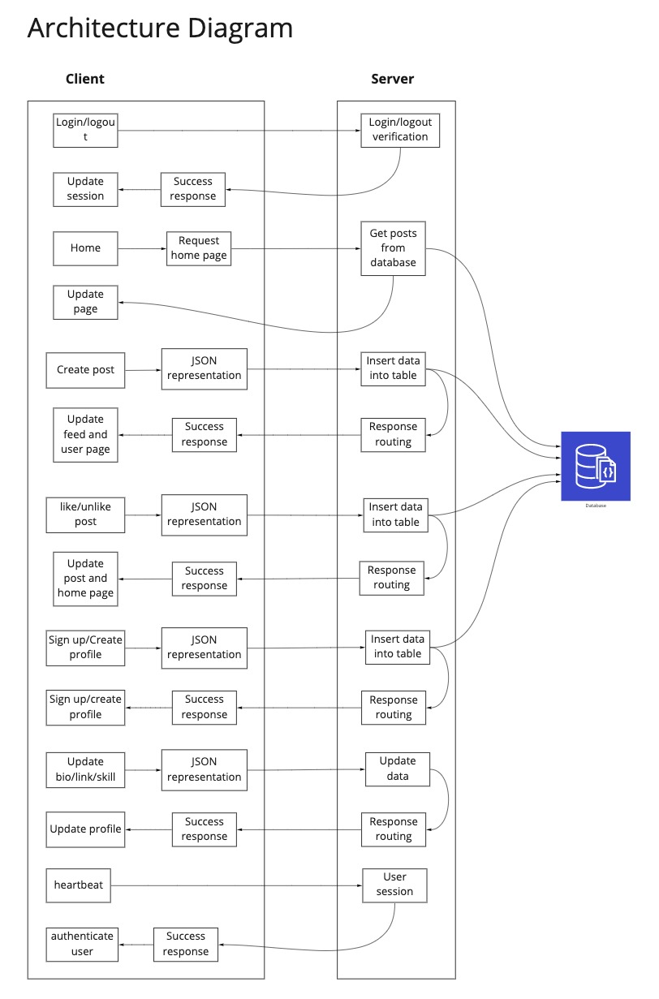
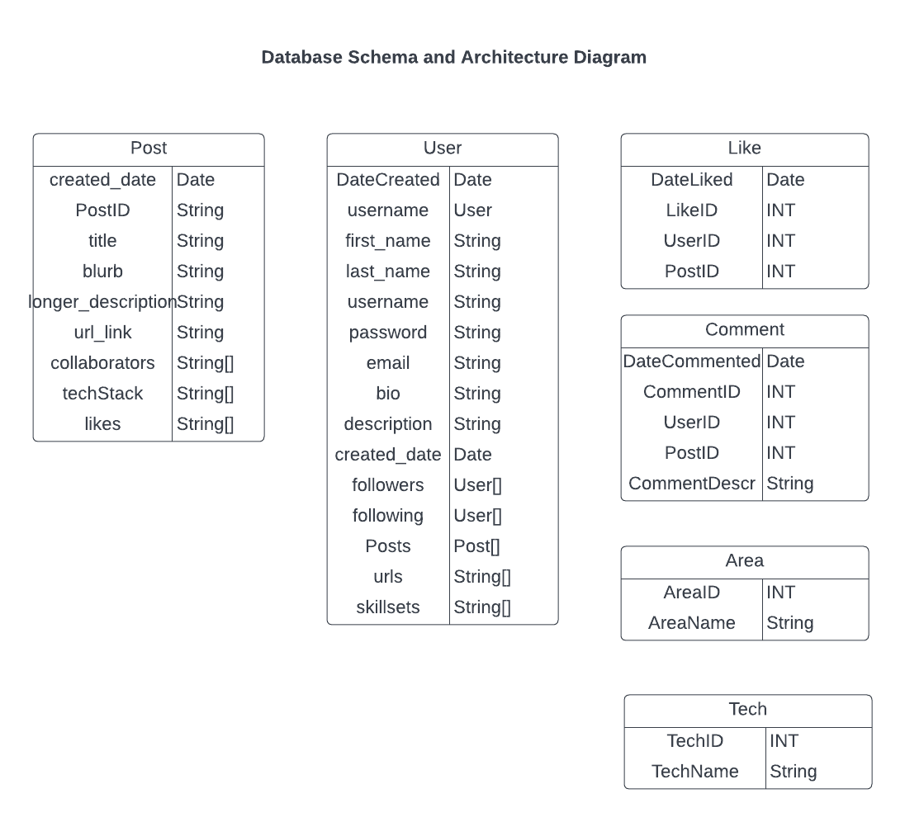

# Info 441 - DevDeck

__Authors:__ Melina Perraut, Max Bennett, Elbert Cheng, Susan Yang

# Project Description

When people think of social media, most of them will say: Facebook. When people think of networking, most of them will say: LinkedIn. How about places to share the cool front-end project you made for your client-side development class or the personal website you built over the summer? Our target audience will be _developers who want to showcase a portfolio containing their work_. Rather than creating a professional, formal application like LinkedIn, we aspire to create a social media platform similar to Instagram and DevPost where developers can post their development projects and share it to the world.

In the collegiate sense, we want to help college students to show off their development projects to other students, strangers, and even recruiters with our platform _DevDeck_! Our college student stakeholders can also use our platform to advertise their brilliant ideas, promote their programming skills, and ultimately nurture their professional development. Additionally, our users can discover projects and topics from posts of people they follow which may inspire them to create more unique projects.

As college students and developers ourselves, we noticed that there were not any mainstream platforms to show off projects and portfolios other than Reddit subreddits. With our application, we want to build interest into development projects around the world in the same fashion that social media does and give our users the ability to attract collaborators and potential sponsors through their project posts. Every day, a new development project is created and _does not get the exposure it deserves_. 

**So play your cards right with DevDeck, and show the world your winning hand.**

# Technical Description

## Architecture Diagram and ERD Diagram

[Miro Board Diagram w/ Additional ERD Diagram](https://miro.com/app/board/uXjVO3_-HAU=/?share_link_id=256322717893)

## Feature Priorites and User Stories

| Priority | User | Description | Technical Implementation | Completed? |
|---|---|---|---| ---|
| P0 | As a developer | I want to showcase existing development projects I’ve completed on my DevDeck profile. | Pull project documents from __MongoDB__, process them in the server, and send the HTML to display to the browser using the __express__ library. | Yes ✅ |
| P0 | As a developer | I want to create an account and log into the site. | Users will input their personal information to make an account using our __own login service__ (which hashes and salts stored passwords). | Yes ✅ |
| P0 | As a recruiter | I want to view projects of developers on the site without being logged into an account. | Project cards, likes, and details are all viewable without logging in. To make changes to posts one must be logged in. | Yes ✅ |
| P0 | As a recruiter | I want to view the profile of developers on the site and contact them about job and sponsorship opportunities. | Profiles are viewable without logging in. If a developer wishes, they can link their Linkedin, GitHub, or other websites on their profile. | Yes ✅ |
| P0 | As a developer | I want to like and comment other developers’ projects. Each post will have likes and comments associated with it. | Each project document in __MongoDB__ will be stored with the number of likes/comments. Comments will also be stored in a separate table that will have an identifier linking each to its respective post. The server will pull this information along with the post when loading the page. | Partially (didn't implement comments) |
| P0 | As a developer | I want to view and explore the projects of other developers I follow. | DevDeck will have a feed of current popular posts, recently added projects, and posts from accounts you follow. The global feed will display all posts from the last 24 hours in descending order of likes, while the following feed will be the same but filtered to only followed accounts. This will all be done through queries to the database and server-side processing. | Partially (didn't implement following feed) |
| P1 | As a developer | I want to explore the most popular or recent projects on the site. | DevDeck will have a feed of both current popular posts, recently added projects, and posts from accounts you follow. The global feed will display all recently created posts in descending order of likes, while the following feed will be the same but filtered to only followed accounts. This will all be done through queries to the database and server-side processing. | Partially (didn't implement following feed) |
| P1 | As a developer | I want to navigate to specific developers' profiles on the site. | Development project cards will include a hyperlink navigating to the creator's profile page, and developer profiles can also be manually inputted in the browser bar. | Yes ✅ |
| P1 | As a developer | I want to view metrics about my projects and portfolio (number of likes, comments, views, etc.). | Each project document in __MongoDB__ will be stored with the number of likes. Comments will also be stored in a separate table that will have an identifier linking each to its respective post. The server will pull this information along with the post when loading the page. Views on each page can also be stored as another field in the project document in __MongoDB__. | Partially (didn't implement comments or views) |
| P1 | As a developer | I want to tag collaborators and fellow developers on my projects. | Each project document in __MongoDB__ can be associated with other profiles/developers in the database through tagging collaborators. If applicable, the server will pull this information along with the post when loading the page. | Partially (collaborators are listed but not linked to other user accounts) |
| P2 | As a site viewer | I want to view, search for, and learn about projects on the site without being logged into an account. | Project cards, likes, and details are all viewable without logging in. To make changes to posts one must be logged in. | Yes ✅ |

## API Endpoints

-   ‘/posts’
    -   GET	-	‘ /single’
        -   Get a specific post by filtering for the postID, 'id', in the query paramter. The post's related information including project details and likes are also retrieved.
 	-	GET		-	'/'
	 	-	If there isn’t a query parameter with the post id, then the server will return all posts for our “Explore” page. If a user's username is specified in the query, then the server will return only the posts created by that user.
	-   POST	-	‘/’
		-   Upload a post with the user-inputted information in the body.
	-   POST	-	‘/like’-   
		- Based on the given post and current user, add a like to the post.
	-   POST	-	‘/unlike’-   
		- Based on the given post and current user, remove an existing like to the post.
-   ‘/users’
	-   GET	-	‘/’
		-   Get the account information with the query parameter, ‘username’, as the username of the specific user being retrieved.
	-   POST	-	‘/signup’
		- Create a new user account with the user-inputted information in the body.
	-   POST	-	‘/login’
		- Log into an existing user account.
	-   POST	-	‘/logout’
		- Log out of an existing user account.
	-   PUT	-	‘/bio’
		- Update user account information based on the given user and inputted bio specified in the body.
	-   PUT	-	‘/links’
		- Update user account information based on the given user and inputted links specified in the body.
	-   PUT	-	‘/skills’
		- Update user account information based on the given user and inputted skills specified in the body.
	-   GET	-	‘/debug’
		-   Change the welcome message to the user based on whether the user is signed in.
	-   GET	-	‘/heartbeat’
		-   Check whether the user session has expired based on the session cookie.
