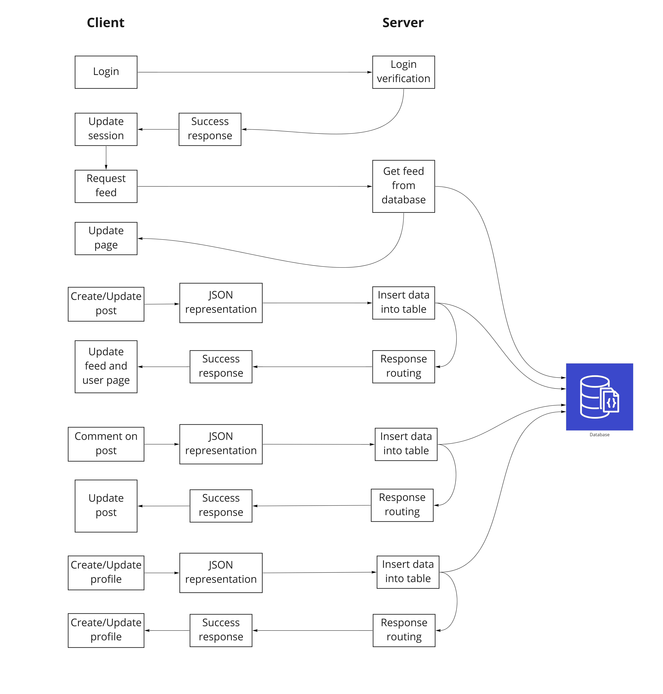

# Info 441 - DevDeck

__Authors:__ Melina Perraut, Max Bennett, Elbert Cheng, Susan Yang

# Project Description

When people think of social media, most of them will say: Facebook. When people think of networking, most of them will say: LinkedIn. How about places to share the cool front-end project you made for your client-side development class or the personal website you built over the summer? Our target audience will be _developers who want to showcase a portfolio containing their work_. Rather than creating a professional, formal application like LinkedIn, we aspire to create a social media platform similar to Instagram and DevPost where developers can post their development projects and share it to the world.

In the collegiate sense, we want to help college students to show off their development projects to other students, strangers, and even recruiters with our platform _DevDeck_! Our college student stakeholders can also use our platform to advertise their brilliant ideas, promote their programming skills, and ultimately nurture their professional development. Additionally, our users can discover projects and topics from posts of people they follow which may inspire them to create more unique projects.

As college students and developers ourselves, we noticed that there were not any mainstream platforms to show off projects and portfolios other than Reddit subreddits. With our application, we want to build interest into development projects around the world in the same fashion that social media does and give our users the ability to attract collaborators and potential sponsors through their project posts. Every day, a new development project is created and _does not get the exposure it deserves_. 

**So play your cards right with DevDeck, and show the world your winning hand.**

# Technical Description

## Architecture Diagram

[Miro Board Diagram w/ Additional ERD Diagram](https://miro.com/app/board/uXjVO3_-HAU=/?share_link_id=256322717893)

## Feature Priorites and User Stories

| Priority | User | Description | Technical Implementation |
|---|---|---|---|
| P0 | As a developer | I want to showcase existing development projects I’ve completed on my DevDeck profile. | Pull project documents from __MongoDB__, process them in the server, and send the HTML to display to the browser using the __express__ library. |
| P0 | As a developer | I want to comment and vote on other developers’ projects. Each post will have likes/votes and comments associated with it. | Each project document in __MongoDB__ will be stored with the number of likes/votes. Comments will also be stored in a separate table that will have an identifier linking each to its respective post. The server will pull this information along with the post when loading the page. |
| P0 | As a developer | I want to create an account and log into the site. | Users will sign in with a Microsoft account with the __microsoft-identity-express__ library. |
| P0 | As a recruiter | I want to view projects of developers on the site without being logged into an account. | Projects, likes/votes, and comments are all viewable without logging in. To make changes to posts one must be logged in. |
| P0 | As a recruiter | I want to view the profile of developers on the site and contact them about job and sponsorship opportunities. | Profiles are viewable without logging in. If a developer wishes, they can link their Linkedin, GitHub, or email on their profile. |
| P0 | As a developer | I want to view and explore the projects of other developers I follow. | DevDeck will have a feed of both current popular posts and posts from accounts you follow. The global feed will display all posts from the last 24 hours in descending order of likes, while the following feed will be the same but filtered to only followed accounts. This will all be done through queries to the database and server-side processing. |
| P1 | As a developer | I want to explore the most popular or recent projects on the site. | DevDeck will have a feed of both current popular posts and posts from accounts you follow. The global feed will display all posts from the last 24 hours in descending order of likes, while the following feed will be the same but filtered to only followed accounts. This will all be done through queries to the database and server-side processing. |
| P1 | As a developer | I want to search for specific projects and developers on the site. | Searching will be a parameter by which to filter the current projects on the server. |
| P1 | As a developer | I want to view metrics about my projects and portfolio (number of likes, comments, views, etc.). | Each project document in __MongoDB__ will be stored with the number of likes/votes. Comments will also be stored in a separate table that will have an identifier linking each to its respective post. The server will pull this information along with the post when loading the page. Views on each page can also be stored as another field in the project document in __MongoDB__. |
| P1 | As a developer | I want to tag collaborators and fellow developers on my projects. | Each project document in __MongoDB__ can be associated with other profiles/developers in the database through tagging collaborators. If applicable, the server will pull this information along with the post when loading the page. |
| P2 | As a site viewer | I want to view, search for, and learn about projects on the site without being logged into an account. | Projects, likes/votes, and comments are all viewable without logging in. To make changes to posts one must be logged in. |

## API Endpoints

-   ‘/posts’
    -   GET	-	‘ /:id’
        -   Get the generated feed (or ‘deck’) of a specific account by filtering for the userID, ‘id’, in the query parameter. With each post gotten, its related information including likes and comments are also retrieved.
 	-	GET		-	'/'
	 	-	If there isn’t a query parameter with the post id, then the server will return all posts for our “Explore” page.
	-   POST	-	‘/’
		-   Upload a post with the user-inputted information in the body.
	-   PUT	-	‘/edit’-   
		- Edit an existing post with input values as body.
		- Add a comment with the comment information in the body or a like to the specific post.
		- Remove a comment or a like from the given post,
	-   DELETE	-	‘/:id’
		- Delete the post with ‘id’ as the postID of the specific post that is going to be deleted.
-   ‘/users’
	-   GET	-	‘/:id’
		-   Get the account information with the query parameter, ‘id’, as the userID of the specific user being retrieved.
	-   POST	-	‘/’
		- Create a new user account with the user-inputted information in the body.
	-   PUT	-	‘/edit’
		- Update user account information based on the information (userID, email, etc.) specified in the body.
